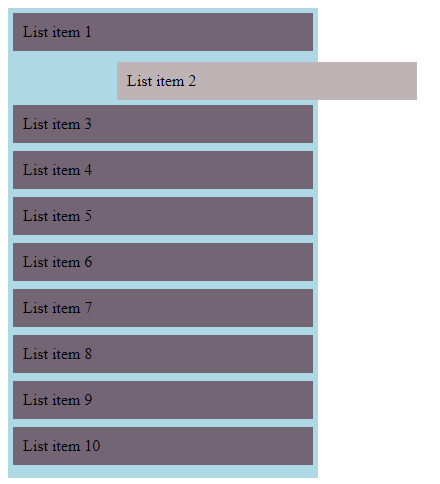

# React Beautiful DnD - Simple Draggable List

A simple React application showcasing drag-and-drop functionality using the `react-beautiful-dnd` library.

## Demo

Explore the live demo: [React Simple Draggable List Demo](https://react-simple-draggable-list.vercel.app/)

## Overview

This project demonstrates a basic implementation of a draggable list with React Beautiful DnD. Users can easily rearrange and reorder list items by dragging and dropping.

## Features

- **Intuitive Drag-and-Drop:** Enjoy a seamless drag-and-drop experience for list items, enhancing user interaction and usability.
- **Responsive Design:** The application is designed to be responsive, ensuring a consistent experience across various devices and screen sizes.

## Usage
To use this project, follow these steps:
1. Clone or download the repository to your local machine.
2. Install dependencies by running `npm install` in your terminal at the root directory of the cl
3. Start the development server with `npm run dev`. This will open a browser window displaying the app

